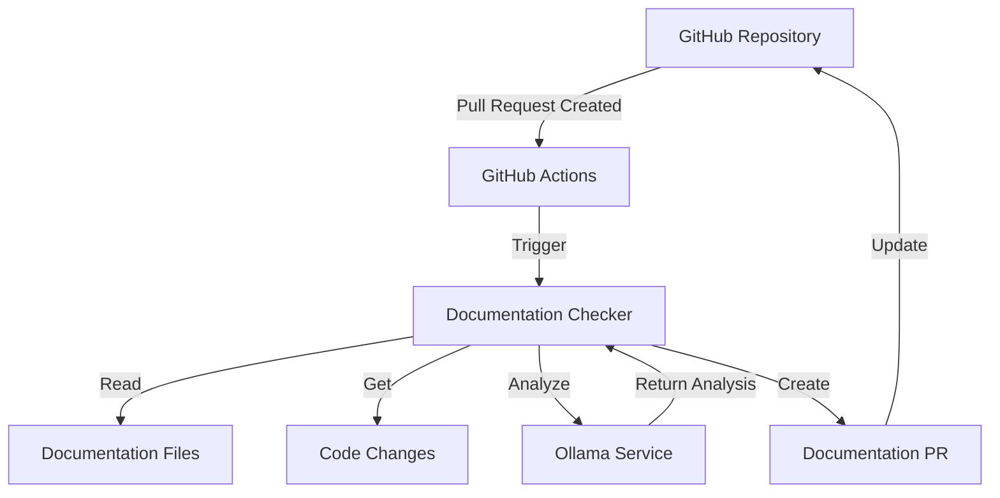

# AI Documentation Checker

A smart tool that automatically checks and updates your project's documentation when code changes are made. It works with GitHub and uses a local AI model (Ollama) to analyze and update documentation.

## Architecture



## What This Tool Does

1. When someone creates or updates a pull request in your GitHub repository
2. The tool automatically:
   - Checks what code has changed
   - Looks at your documentation (like README.md and files in the docs folder)
   - Uses Ollama to see if the documentation needs updates
   - If updates are needed, it creates a new pull request with the changes
   - If everything is up to date, it does nothing

## Easy Setup Guide

### Step 1: Add Files to Your GitHub Repository

1. Create a new folder called `.github/workflows` in your repository
2. Copy the `doc-checker.yml` file into the `.github/workflows` folder
3. Copy the `doc-checker.py` and `requirements.txt` files to the root of your repository

### Step 2: Set Up Ollama

1. Install Ollama:
   - For Mac: Open Terminal and run:
     ```bash
     curl -fsSL https://ollama.com/install.sh | sh
     ```
   - For Windows: Download from [Ollama's website](https://ollama.com/)
   - For Linux: Follow instructions at [Ollama's website](https://ollama.com/)

2. Download an AI model:
   - Open Terminal (or Command Prompt on Windows)
   - Run: `ollama pull llama2` (or any other model you prefer)

3. Start Ollama:
   - The service should start automatically
   - You can check if it's running by opening: http://localhost:11434

4. In your GitHub repository:
   - Go to Settings → Secrets and variables → Actions
   - Add these secrets (optional, as these are the defaults):
     - Name: `LLM_MODEL`, Value: `llama2` (or your chosen model)
     - Name: `OLLAMA_HOST`, Value: `http://localhost:11434`

### Step 3: Set Up Your Documentation

1. Make sure your documentation is in one of these places:
   - `README.md` file in your repository
   - Files in a `docs/` folder
   - You can add more locations by editing the `DOC_PATHS` in `doc-checker.py`

### Step 4: Test It Out

1. Create a new branch in your repository
2. Make some changes to your code
3. Create a pull request
4. The tool will automatically run and check if documentation needs updates

## Troubleshooting

### Common Issues

1. **Action not running**
   - Check if the files are in the correct locations
   - Make sure you've added all required secrets
   - Check the Actions tab in your repository for error messages

2. **Ollama not working**
   - Make sure Ollama is running
   - Check if you can access http://localhost:11434
   - Try running `ollama list` to see if your model is downloaded

3. **Documentation not being updated**
   - Check if your documentation files are in the correct locations
   - Make sure the AI model has enough context to understand the changes

## Customization

You can change these settings by editing the files:

1. In `doc-checker.py`:
   - `DOC_PATHS`: Add more folders or files to check
   - `MODEL`: Change the AI model (for advanced users)

2. In `.github/workflows/doc-checker.yml`:
   - Change when the tool runs (default: on pull requests)
   - Adjust Python version (default: 3.11)

## Need Help?

1. Check the [GitHub Actions documentation](https://docs.github.com/en/actions)
2. Visit [Ollama's website](https://ollama.com/) for Ollama help

## Requirements

- A GitHub repository
- Python 3.11 or newer
- Ollama installed and running

## License

MIT - Feel free to use and modify as needed! 